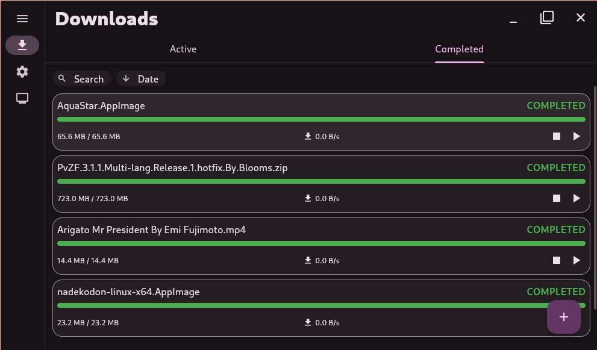
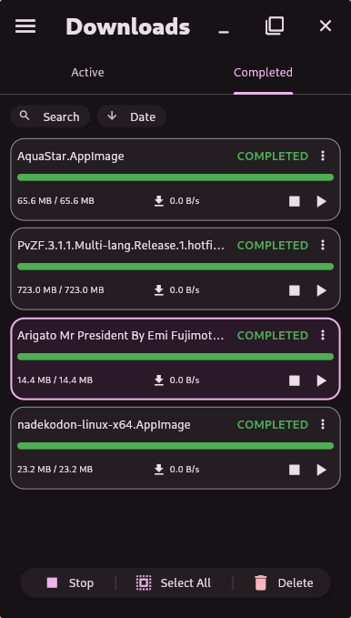
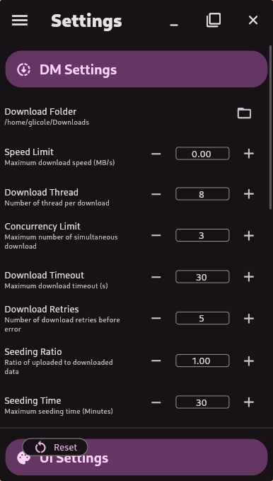
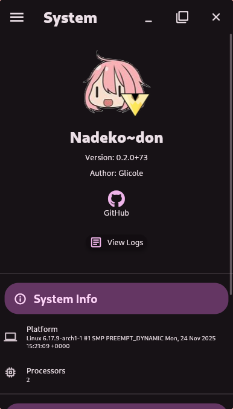

<div align="center">
  <a href="https://github.com/izaz4141/nadekodon-rs">
    
  </a>
  <h3>Nadeko~don</h3>
  <p>A modern, cross-platform Download Manager</p>
  <p>
    <a href="https://github.com/izaz4141/nadekodon-rs/releases"></a>
    <a href="https://github.com/izaz4141/nadekodon-rs/blob/main/LICENSE.md"></a>
    <a href="https://github.com/izaz4141/nadekodon-rs/actions/workflows/build.yml"></a>
  </p>
  
  <p>
    <a href="#features">Features</a> •
    <a href="#screenshots">Screenshots</a> •
    <a href="#roadmap">Roadmap</a> •
    <a href="#installation">Installation</a> •
    <a href="#contributing">Contributing</a> •
    <a href="#license">License</a>
  </p>

</div>

<p>
Nadeko~don is a open-source download manager designed for efficiency and a seamless user experience across multiple operating systems. By leveraging a Rust backend for heavy lifting and a Flutter frontend for a rich, responsive UI, it offers a powerful and reliable tool for managing all your downloads.
</p>

## Features

- **High Performance**: The core logic is written in Rust, utilizing async operations to handle multiple downloads concurrently with minimal resource consumption.
- **Cross-Platform**: A single codebase supports Linux, Windows, and Android, providing a consistent experience everywhere.
- **Browser Integration**: A companion browser extension, [**NadeCon**](https://github.com/izaz4141/NadeCon), captures download links directly from your browser. This is facilitated by a local server that runs alongside the application.
- **YT-DLP Support**: Download videos and audio from thousands of websites by pasting a URL. Nadeko~don integrates `yt-dlp` to handle the extraction.
- **System Tray Operation**: The application can be minimized to the system tray, allowing it to run in the background without cluttering your desktop.
- **Modern UI**: A clean and intuitive user interface built with Flutter, following Material Design 3 principles.

## Screenshots

<details close>
  <summary>Desktop</summary>
    
</details>

<details close>
  <summary>Mobile</summary>
    
    
    
</details>

## Roadmap

Here are some of the features and improvements planned for future releases:

- [ ] Download scheduler
- [ ] Proxy support
- [ ] Open the app from link
- [ ] Web & Docker support
- [ ] Variable/scheduled download bandwith

## Installation

There are two ways to install Nadeko~don: by downloading a pre-built version from the releases page, or by compiling it from source.

### From Releases

You can download the latest pre-built binaries for your operating system from the [**Releases**](https://github.com/izaz4141/nadekodon-rs/releases) page.
- **Windows**: Download and extract the `.zip` archive.
- **Linux**: Download the `.AppImage` file and make it executable.
- **Android**: Download and install the `.apk` file.

### From Source

If you prefer to compile the application yourself, you can follow these steps. Make sure you have Flutter and Rust installed on your system. For more detailed instructions, refer to the [DEVELOPMENT](DEVELOPMENT.md) file.

1.  **Clone the repository:**
    ```sh
    git clone https://github.com/izaz4141/nadekodon-rs.git
    cd nadekodon-rs
    ```

2.  **Generate Rinf bindings:**
    ```sh
    rinf gen
    ```

3.  **Build the application:**
    ```sh
    fvm flutter build
    ```


## License

This project is licensed under the AGPL-3.0 License. See the [**LICENSE**](LICENSE.md) file for details.
